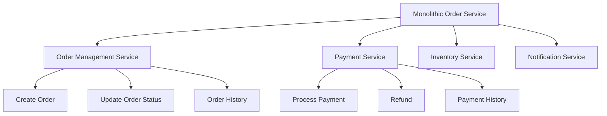
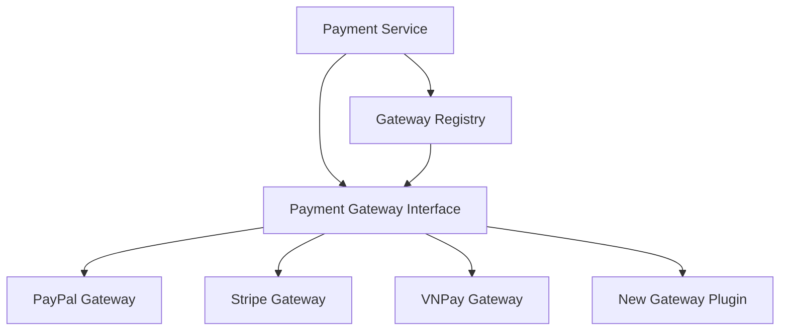
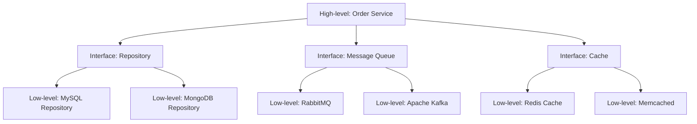
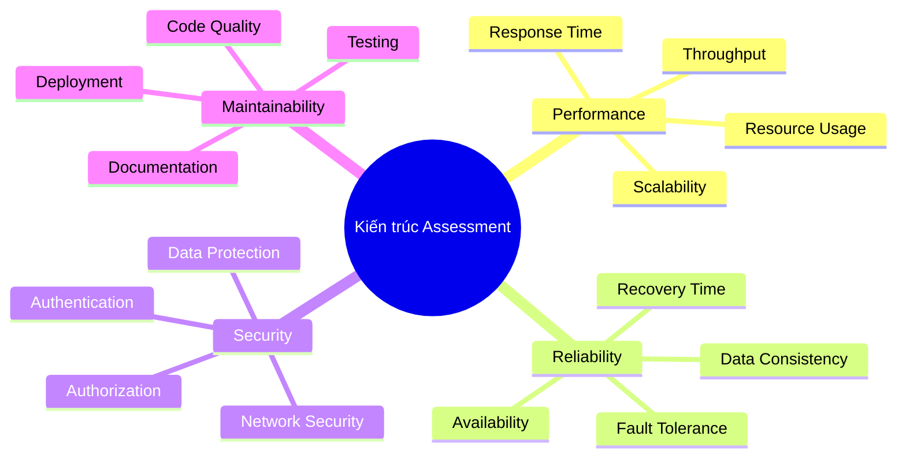
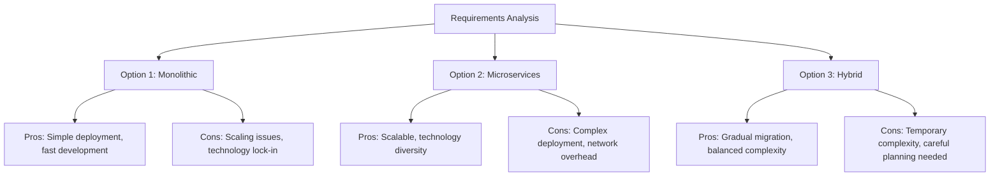
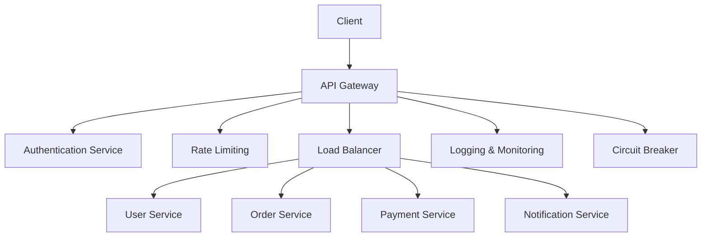
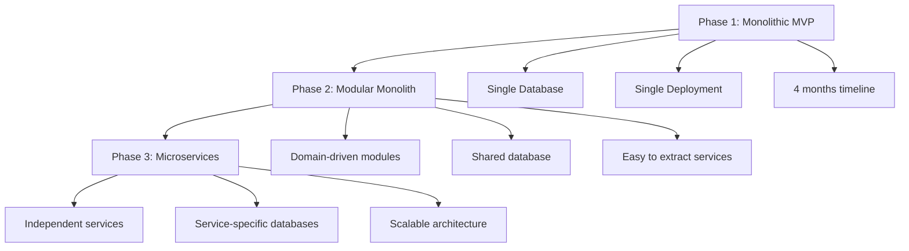
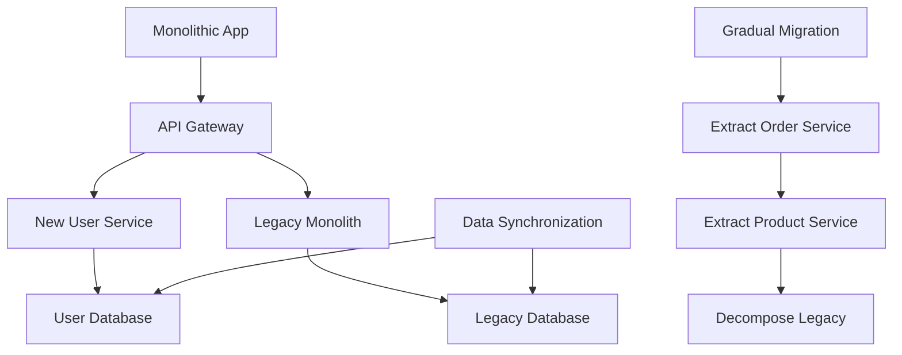

# 🔧 **Hướng dẫn Server-Side Developer: Áp dụng Nguyên lý Thiết kế để Tùy chỉnh Kiến trúc**

> **Cầu nối giữa lý thuyết và thực hành** - Hướng dẫn chi tiết cho server-side developer về cách áp dụng các nguyên lý thiết kế phần mềm để tùy chỉnh kiến trúc cho phù hợp với thực tế dự án.

---

## 📋 **Tổng quan**

### 🎯 Mục tiêu
- Hiểu cách áp dụng nguyên lý thiết kế vào kiến trúc thực tế
- Biết cách đánh giá và tùy chỉnh kiến trúc cho phù hợp với dự án
- Nắm vững quy trình từ requirements đến implementation
- Phát triển khả năng ra quyết định kiến trúc có căn cứ

### 👥 Đối tượng
- **Server-side Developer** với 1-3 năm kinh nghiệm
- **Backend Engineer** muốn nâng cao kỹ năng kiến trúc
- **Junior Architect** cần hiểu sâu về áp dụng thực tế

---

## 🏗️ **Phần 1: Nguyên lý Thiết kế Cơ bản**

### 1.1 SOLID Principles trong Kiến trúc

#### **Single Responsibility Principle (SRP) - Áp dụng vào Microservices**



**Thực tế áp dụng:**
```python
# ❌ Vi phạm SRP - Service làm quá nhiều việc
class OrderService:
    def create_order(self, order_data):
        # Validate order
        # Calculate pricing
        # Process payment
        # Update inventory
        # Send notification
        # Log audit trail
        pass

# ✅ Tuân thủ SRP - Mỗi service có 1 trách nhiệm
class OrderService:
    def __init__(self, payment_service, inventory_service, notification_service):
        self.payment_service = payment_service
        self.inventory_service = inventory_service
        self.notification_service = notification_service
    
    def create_order(self, order_data):
        order = self._validate_and_create_order(order_data)
        self.payment_service.process_payment(order.payment_info)
        self.inventory_service.reserve_items(order.items)
        self.notification_service.send_order_confirmation(order)
        return order
```

#### **Open/Closed Principle (OCP) - Plugin Architecture**



**Thực tế áp dụng:**
```python
# Định nghĩa interface
from abc import ABC, abstractmethod

class PaymentGateway(ABC):
    @abstractmethod
    def process_payment(self, amount, currency, payment_method):
        pass
    
    @abstractmethod
    def refund_payment(self, transaction_id, amount):
        pass

# Implement cụ thể
class StripeGateway(PaymentGateway):
    def process_payment(self, amount, currency, payment_method):
        # Stripe-specific implementation
        pass
    
    def refund_payment(self, transaction_id, amount):
        # Stripe refund logic
        pass

# Payment Service không cần thay đổi khi thêm gateway mới
class PaymentService:
    def __init__(self):
        self.gateways = {
            'stripe': StripeGateway(),
            'paypal': PayPalGateway(),
            'vnpay': VNPayGateway()
        }
    
    def process_payment(self, gateway_type, amount, currency, payment_method):
        gateway = self.gateways.get(gateway_type)
        if not gateway:
            raise ValueError(f"Unsupported gateway: {gateway_type}")
        return gateway.process_payment(amount, currency, payment_method)
```

### 1.2 Dependency Inversion Principle (DIP) trong Kiến trúc



**Thực tế áp dụng:**
```python
# High-level module không phụ thuộc vào low-level module
class OrderService:
    def __init__(self, repository: OrderRepository, message_queue: MessageQueue):
        self.repository = repository
        self.message_queue = message_queue
    
    def create_order(self, order_data):
        order = Order(order_data)
        saved_order = self.repository.save(order)
        self.message_queue.publish('order.created', saved_order.to_dict())
        return saved_order

# Interface definitions
class OrderRepository(ABC):
    @abstractmethod
    def save(self, order: Order) -> Order:
        pass
    
    @abstractmethod
    def find_by_id(self, order_id: str) -> Order:
        pass

class MessageQueue(ABC):
    @abstractmethod
    def publish(self, topic: str, message: dict):
        pass
```

---

## 🎯 **Phần 2: Đánh giá và Tùy chỉnh Kiến trúc**

### 2.1 Framework Đánh giá Kiến trúc

#### **Checklist Đánh giá Kiến trúc**



#### **Ma trận Đánh giá Chi tiết**

| Tiêu chí | Mức độ quan trọng | Trạng thái hiện tại | Mục tiêu | Hành động |
|----------|-------------------|---------------------|----------|-----------|
| **Performance** | | | | |
| Response Time | High | 500ms avg | <200ms | Cache layer, DB optimization |
| Throughput | High | 1000 req/s | 5000 req/s | Load balancer, horizontal scaling |
| **Reliability** | | | | |
| Availability | Critical | 99.5% | 99.9% | Redundancy, health checks |
| Data Consistency | High | Eventually consistent | Strong consistency | Transaction management |
| **Security** | | | | |
| Authentication | Critical | Basic Auth | OAuth2 + JWT | Implement OAuth server |
| Authorization | High | Role-based | Fine-grained RBAC | Policy engine |

### 2.2 Quy trình Tùy chỉnh Kiến trúc

#### **Bước 1: Phân tích Requirements**

```python
# Template phân tích requirements
class RequirementsAnalysis:
    def __init__(self):
        self.functional_requirements = []
        self.non_functional_requirements = {}
        self.constraints = []
        self.assumptions = []
    
    def analyze_performance_requirements(self):
        return {
            'expected_users': 10000,
            'concurrent_users': 1000,
            'response_time': '< 200ms',
            'throughput': '5000 req/s',
            'availability': '99.9%'
        }
    
    def analyze_business_requirements(self):
        return {
            'growth_projection': '5x in 2 years',
            'budget_constraints': 'Medium',
            'timeline': '6 months',
            'team_size': 5,
            'technology_preferences': ['Python', 'PostgreSQL', 'Redis']
        }
```

#### **Bước 2: Thiết kế Architecture Options**



#### **Bước 3: Trade-off Analysis**

```python
# Framework so sánh các options
class ArchitectureComparison:
    def __init__(self):
        self.options = {}
        self.criteria = [
            'development_speed', 'scalability', 'maintainability',
            'deployment_complexity', 'cost', 'team_expertise'
        ]
    
    def add_option(self, name, scores):
        """
        scores: dict với key là criteria, value là score 1-10
        """
        self.options[name] = scores
    
    def weighted_comparison(self, weights):
        """
        weights: dict với key là criteria, value là trọng số
        """
        results = {}
        for option, scores in self.options.items():
            total_score = sum(scores[criteria] * weights[criteria] 
                            for criteria in self.criteria)
            results[option] = total_score
        return results

# Ví dụ sử dụng
comparison = ArchitectureComparison()
comparison.add_option('monolithic', {
    'development_speed': 9,
    'scalability': 4,
    'maintainability': 6,
    'deployment_complexity': 9,
    'cost': 8,
    'team_expertise': 9
})

comparison.add_option('microservices', {
    'development_speed': 5,
    'scalability': 9,
    'maintainability': 7,
    'deployment_complexity': 4,
    'cost': 5,
    'team_expertise': 5
})

weights = {
    'development_speed': 0.2,
    'scalability': 0.3,
    'maintainability': 0.2,
    'deployment_complexity': 0.1,
    'cost': 0.1,
    'team_expertise': 0.1
}

results = comparison.weighted_comparison(weights)
```

---

## 🔄 **Phần 3: Quy trình Từ Lý thuyết Đến Thực hành**

### 3.1 Design Patterns trong Kiến trúc

#### **Repository Pattern - Thực tế áp dụng**

```python
# Lý thuyết: Repository Pattern
class UserRepository(ABC):
    @abstractmethod
    def find_by_id(self, user_id: str) -> User:
        pass
    
    @abstractmethod
    def save(self, user: User) -> User:
        pass

# Thực hành: Áp dụng vào dự án e-commerce
class DatabaseUserRepository(UserRepository):
    def __init__(self, db_connection):
        self.db = db_connection
    
    def find_by_id(self, user_id: str) -> User:
        query = "SELECT * FROM users WHERE id = %s"
        result = self.db.execute(query, (user_id,))
        return User.from_dict(result) if result else None
    
    def save(self, user: User) -> User:
        if user.id:
            # Update existing user
            query = """
                UPDATE users 
                SET name = %s, email = %s, updated_at = %s 
                WHERE id = %s
            """
            self.db.execute(query, (user.name, user.email, datetime.now(), user.id))
        else:
            # Create new user
            query = """
                INSERT INTO users (name, email, created_at) 
                VALUES (%s, %s, %s) 
                RETURNING id
            """
            result = self.db.execute(query, (user.name, user.email, datetime.now()))
            user.id = result['id']
        return user

# Caching Repository Decorator
class CachedUserRepository(UserRepository):
    def __init__(self, base_repository: UserRepository, cache):
        self.base_repository = base_repository
        self.cache = cache
    
    def find_by_id(self, user_id: str) -> User:
        cache_key = f"user:{user_id}"
        cached_user = self.cache.get(cache_key)
        if cached_user:
            return User.from_dict(cached_user)
        
        user = self.base_repository.find_by_id(user_id)
        if user:
            self.cache.set(cache_key, user.to_dict(), ttl=3600)
        return user
```

#### **Event Sourcing Pattern - Thực tế áp dụng**

```python
# Lý thuyết: Event Sourcing
class Event:
    def __init__(self, event_type, aggregate_id, data, timestamp=None):
        self.event_type = event_type
        self.aggregate_id = aggregate_id
        self.data = data
        self.timestamp = timestamp or datetime.now()

# Thực hành: Order System với Event Sourcing
class OrderEvents:
    ORDER_CREATED = "order.created"
    ORDER_CONFIRMED = "order.confirmed"
    ORDER_SHIPPED = "order.shipped"
    ORDER_DELIVERED = "order.delivered"
    ORDER_CANCELLED = "order.cancelled"

class OrderAggregate:
    def __init__(self, order_id):
        self.order_id = order_id
        self.status = "draft"
        self.items = []
        self.total_amount = 0
        self.events = []
    
    def create_order(self, customer_id, items):
        event = Event(
            OrderEvents.ORDER_CREATED,
            self.order_id,
            {
                'customer_id': customer_id,
                'items': items,
                'total_amount': sum(item['price'] * item['quantity'] for item in items)
            }
        )
        self.apply_event(event)
        return event
    
    def apply_event(self, event):
        if event.event_type == OrderEvents.ORDER_CREATED:
            self.status = "created"
            self.items = event.data['items']
            self.total_amount = event.data['total_amount']
        elif event.event_type == OrderEvents.ORDER_CONFIRMED:
            self.status = "confirmed"
        # ... other event handlers
        
        self.events.append(event)

# Event Store Implementation
class EventStore:
    def __init__(self, db_connection):
        self.db = db_connection
    
    def save_events(self, aggregate_id, events, expected_version):
        for event in events:
            query = """
                INSERT INTO events (aggregate_id, event_type, event_data, timestamp, version)
                VALUES (%s, %s, %s, %s, %s)
            """
            self.db.execute(query, (
                aggregate_id,
                event.event_type,
                json.dumps(event.data),
                event.timestamp,
                expected_version + 1
            ))
    
    def get_events(self, aggregate_id):
        query = """
            SELECT event_type, event_data, timestamp 
            FROM events 
            WHERE aggregate_id = %s 
            ORDER BY version
        """
        results = self.db.execute(query, (aggregate_id,))
        return [Event(r['event_type'], aggregate_id, json.loads(r['event_data']), r['timestamp']) 
                for r in results]
```

### 3.2 Microservices Patterns

#### **API Gateway Pattern**



**Thực tế implementation:**

```python
# API Gateway với FastAPI
from fastapi import FastAPI, Request, HTTPException
from fastapi.middleware.cors import CORSMiddleware
import httpx
import asyncio
from datetime import datetime, timedelta

app = FastAPI(title="API Gateway")

# Service Registry
SERVICES = {
    'user': 'http://user-service:8001',
    'order': 'http://order-service:8002',
    'payment': 'http://payment-service:8003'
}

# Rate Limiting
class RateLimiter:
    def __init__(self):
        self.requests = {}
    
    def is_allowed(self, client_id: str, limit: int = 100, window: int = 60):
        now = datetime.now()
        window_start = now - timedelta(seconds=window)
        
        if client_id not in self.requests:
            self.requests[client_id] = []
        
        # Remove old requests
        self.requests[client_id] = [
            req_time for req_time in self.requests[client_id]
            if req_time > window_start
        ]
        
        if len(self.requests[client_id]) >= limit:
            return False
        
        self.requests[client_id].append(now)
        return True

rate_limiter = RateLimiter()

# Circuit Breaker
class CircuitBreaker:
    def __init__(self, failure_threshold=5, recovery_timeout=30):
        self.failure_threshold = failure_threshold
        self.recovery_timeout = recovery_timeout
        self.failure_count = 0
        self.last_failure_time = None
        self.state = "CLOSED"  # CLOSED, OPEN, HALF_OPEN
    
    async def call(self, func, *args, **kwargs):
        if self.state == "OPEN":
            if datetime.now() - self.last_failure_time > timedelta(seconds=self.recovery_timeout):
                self.state = "HALF_OPEN"
            else:
                raise HTTPException(status_code=503, detail="Circuit breaker is OPEN")
        
        try:
            result = await func(*args, **kwargs)
            if self.state == "HALF_OPEN":
                self.state = "CLOSED"
                self.failure_count = 0
            return result
        except Exception as e:
            self.failure_count += 1
            self.last_failure_time = datetime.now()
            if self.failure_count >= self.failure_threshold:
                self.state = "OPEN"
            raise e

circuit_breaker = CircuitBreaker()

# Middleware
@app.middleware("http")
async def rate_limit_middleware(request: Request, call_next):
    client_id = request.client.host
    if not rate_limiter.is_allowed(client_id):
        raise HTTPException(status_code=429, detail="Rate limit exceeded")
    
    response = await call_next(request)
    return response

# Proxy routes
@app.api_route("/{service}/{path:path}", methods=["GET", "POST", "PUT", "DELETE"])
async def proxy_request(service: str, path: str, request: Request):
    if service not in SERVICES:
        raise HTTPException(status_code=404, detail="Service not found")
    
    service_url = f"{SERVICES[service]}/{path}"
    
    async def make_request():
        async with httpx.AsyncClient() as client:
            response = await client.request(
                method=request.method,
                url=service_url,
                headers=dict(request.headers),
                content=await request.body()
            )
            return response
    
    try:
        response = await circuit_breaker.call(make_request)
        return response.json()
    except Exception as e:
        raise HTTPException(status_code=500, detail=str(e))
```

---

## 🏆 **Phần 4: Case Studies Thực tế**

### 4.1 Case Study 1: E-commerce System

#### **Bối cảnh**
- Startup e-commerce với 50,000 users
- Dự kiến tăng trưởng 10x trong 1 năm
- Team 8 developers
- Budget hạn chế

#### **Quá trình ra quyết định**

**Phase 1: Requirements Analysis**
```python
requirements = {
    'functional': [
        'User registration/login',
        'Product catalog',
        'Shopping cart',
        'Order processing',
        'Payment processing',
        'Inventory management'
    ],
    'non_functional': {
        'performance': {
            'response_time': '< 500ms',
            'throughput': '1000 req/s',
            'availability': '99.5%'
        },
        'scalability': {
            'user_growth': '10x in 12 months',
            'data_growth': '5x in 12 months'
        },
        'security': {
            'data_protection': 'GDPR compliant',
            'payment_security': 'PCI DSS'
        }
    },
    'constraints': {
        'budget': 'Limited',
        'timeline': '4 months MVP',
        'team_size': 8,
        'expertise': 'Full-stack JavaScript, Python'
    }
}
```

**Phase 2: Architecture Evolution**



**Phase 1 Implementation (Monolithic MVP):**
```python
# Project structure
"""
ecommerce_app/
├── app/
│   ├── models/
│   │   ├── user.py
│   │   ├── product.py
│   │   └── order.py
│   ├── services/
│   │   ├── user_service.py
│   │   ├── product_service.py
│   │   └── order_service.py
│   ├── api/
│   │   ├── user_api.py
│   │   ├── product_api.py
│   │   └── order_api.py
│   └── main.py
├── requirements.txt
└── docker-compose.yml
"""

# Domain-driven structure để dễ tách sau này
class UserService:
    def __init__(self, user_repository):
        self.user_repository = user_repository
    
    def register_user(self, user_data):
        # Business logic
        pass
    
    def authenticate_user(self, credentials):
        # Authentication logic
        pass

class OrderService:
    def __init__(self, order_repository, inventory_service, payment_service):
        self.order_repository = order_repository
        self.inventory_service = inventory_service
        self.payment_service = payment_service
    
    def create_order(self, user_id, items):
        # Validate inventory
        for item in items:
            if not self.inventory_service.check_availability(item['product_id'], item['quantity']):
                raise InsufficientInventoryError()
        
        # Process payment
        payment_result = self.payment_service.process_payment(
            user_id, self._calculate_total(items)
        )
        
        # Create order
        order = Order(user_id=user_id, items=items, status='confirmed')
        return self.order_repository.save(order)
```

**Phase 2 Migration (Modular Monolith):**
```python
# Cấu trúc module rõ ràng
"""
ecommerce_app/
├── modules/
│   ├── user/
│   │   ├── domain/
│   │   ├── application/
│   │   ├── infrastructure/
│   │   └── api/
│   ├── product/
│   │   ├── domain/
│   │   ├── application/
│   │   ├── infrastructure/
│   │   └── api/
│   └── order/
│       ├── domain/
│       ├── application/
│       ├── infrastructure/
│       └── api/
├── shared/
│   ├── database/
│   ├── messaging/
│   └── monitoring/
└── main.py
"""

# Event-driven communication giữa modules
class EventBus:
    def __init__(self):
        self.handlers = {}
    
    def subscribe(self, event_type, handler):
        if event_type not in self.handlers:
            self.handlers[event_type] = []
        self.handlers[event_type].append(handler)
    
    def publish(self, event):
        handlers = self.handlers.get(event.event_type, [])
        for handler in handlers:
            handler(event)

# Order module publishes events
class OrderService:
    def __init__(self, order_repository, event_bus):
        self.order_repository = order_repository
        self.event_bus = event_bus
    
    def create_order(self, user_id, items):
        order = Order(user_id=user_id, items=items)
        saved_order = self.order_repository.save(order)
        
        # Publish event instead of direct call
        self.event_bus.publish(OrderCreated(
            order_id=saved_order.id,
            user_id=user_id,
            items=items
        ))
        
        return saved_order

# Inventory module subscribes to events
class InventoryService:
    def __init__(self, inventory_repository, event_bus):
        self.inventory_repository = inventory_repository
        event_bus.subscribe('order.created', self.handle_order_created)
    
    def handle_order_created(self, event):
        for item in event.items:
            self.inventory_repository.reduce_stock(
                item['product_id'], 
                item['quantity']
            )
```

### 4.2 Case Study 2: Migration từ Monolith to Microservices

#### **Chiến lược Strangler Fig Pattern**



**Implementation Strategy:**

```python
# Step 1: Extract User Service
class UserMigrationService:
    def __init__(self, legacy_db, new_user_service):
        self.legacy_db = legacy_db
        self.new_user_service = new_user_service
    
    async def migrate_user_data(self, batch_size=1000):
        offset = 0
        while True:
            users = self.legacy_db.get_users(offset, batch_size)
            if not users:
                break
            
            for user in users:
                try:
                    await self.new_user_service.create_user(user)
                except Exception as e:
                    logger.error(f"Failed to migrate user {user.id}: {e}")
            
            offset += batch_size
    
    async def sync_user_updates(self):
        # CDC (Change Data Capture) pattern
        changes = self.legacy_db.get_user_changes_since(self.last_sync)
        for change in changes:
            await self.new_user_service.apply_change(change)

# Step 2: API Gateway routing
class APIGatewayRouter:
    def __init__(self):
        self.migration_percentage = 0  # Start with 0%
    
    def route_user_request(self, request):
        # Canary deployment: gradually increase traffic to new service
        if self.should_route_to_new_service(request.user_id):
            return self.route_to_new_user_service(request)
        else:
            return self.route_to_legacy_service(request)
    
    def should_route_to_new_service(self, user_id):
        # Route based on user ID hash for consistent experience
        return hash(user_id) % 100 < self.migration_percentage

# Step 3: Data consistency during migration
class EventualConsistencyManager:
    def __init__(self, event_store, saga_manager):
        self.event_store = event_store
        self.saga_manager = saga_manager
    
    async def handle_user_update(self, user_id, updates):
        # Saga pattern for distributed transactions
        saga = UserUpdateSaga(user_id, updates)
        await self.saga_manager.execute_saga(saga)
    
class UserUpdateSaga:
    def __init__(self, user_id, updates):
        self.user_id = user_id
        self.updates = updates
        self.steps = [
            self.update_legacy_system,
            self.update_new_user_service,
            self.verify_consistency
        ]
    
    async def update_legacy_system(self):
        # Update legacy database
        pass
    
    async def update_new_user_service(self):
        # Update new service
        pass
    
    async def verify_consistency(self):
        # Verify data consistency
        pass
```

---

## 📊 **Phần 5: Monitoring và Đánh giá**

### 5.1 Architecture Metrics

```python
# Metrics collection framework
class ArchitectureMetrics:
    def __init__(self):
        self.metrics = {
            'performance': PerformanceMetrics(),
            'reliability': ReliabilityMetrics(),
            'security': SecurityMetrics(),
            'maintainability': MaintainabilityMetrics()
        }
    
    def collect_metrics(self):
        results = {}
        for category, metric_collector in self.metrics.items():
            results[category] = metric_collector.collect()
        return results

class PerformanceMetrics:
    def collect(self):
        return {
            'response_time_p95': self.get_response_time_percentile(95),
            'response_time_p99': self.get_response_time_percentile(99),
            'throughput': self.get_throughput(),
            'error_rate': self.get_error_rate(),
            'cpu_usage': self.get_cpu_usage(),
            'memory_usage': self.get_memory_usage()
        }

class ReliabilityMetrics:
    def collect(self):
        return {
            'availability': self.calculate_availability(),
            'mttr': self.calculate_mttr(),  # Mean Time To Recovery
            'mtbf': self.calculate_mtbf(),  # Mean Time Between Failures
            'sla_compliance': self.check_sla_compliance()
        }

# Dashboard configuration
ARCHITECTURE_DASHBOARD = {
    'performance': {
        'response_time': {'threshold': 200, 'unit': 'ms'},
        'throughput': {'threshold': 1000, 'unit': 'req/s'},
        'error_rate': {'threshold': 1, 'unit': '%'}
    },
    'reliability': {
        'availability': {'threshold': 99.9, 'unit': '%'},
        'mttr': {'threshold': 15, 'unit': 'minutes'}
    },
    'costs': {
        'infrastructure': {'threshold': 10000, 'unit': 'USD/month'},
        'operational': {'threshold': 5000, 'unit': 'USD/month'}
    }
}
```

### 5.2 Continuous Architecture Improvement

```python
# Architecture evolution tracking
class ArchitectureEvolution:
    def __init__(self):
        self.decisions = []
        self.metrics_history = []
    
    def record_decision(self, decision):
        """Record architectural decision with context"""
        self.decisions.append({
            'timestamp': datetime.now(),
            'decision': decision,
            'context': decision.context,
            'consequences': decision.consequences,
            'status': 'active'
        })
    
    def evaluate_decisions(self):
        """Evaluate past decisions based on current metrics"""
        current_metrics = self.get_current_metrics()
        
        for decision in self.decisions:
            if decision['status'] == 'active':
                evaluation = self.evaluate_decision_impact(
                    decision, current_metrics
                )
                decision['evaluation'] = evaluation
    
    def suggest_improvements(self):
        """AI-powered suggestions for architecture improvements"""
        suggestions = []
        
        # Analyze performance bottlenecks
        bottlenecks = self.identify_bottlenecks()
        for bottleneck in bottlenecks:
            suggestions.append(
                self.generate_improvement_suggestion(bottleneck)
            )
        
        # Analyze cost optimization opportunities
        cost_optimizations = self.identify_cost_optimizations()
        suggestions.extend(cost_optimizations)
        
        return suggestions

# Example improvement suggestions
class ImprovementSuggestion:
    def __init__(self, category, priority, description, impact, effort):
        self.category = category
        self.priority = priority
        self.description = description
        self.impact = impact
        self.effort = effort
    
    def to_dict(self):
        return {
            'category': self.category,
            'priority': self.priority,
            'description': self.description,
            'impact': self.impact,
            'effort': self.effort
        }

# Automated suggestions
def generate_performance_suggestions(metrics):
    suggestions = []
    
    if metrics['response_time_p95'] > 500:
        suggestions.append(ImprovementSuggestion(
            category='performance',
            priority='high',
            description='Implement caching layer to reduce response time',
            impact='Reduce response time by 60-70%',
            effort='2-3 weeks'
        ))
    
    if metrics['cpu_usage'] > 80:
        suggestions.append(ImprovementSuggestion(
            category='scalability',
            priority='high',
            description='Implement horizontal scaling with load balancer',
            impact='Handle 5x more traffic',
            effort='1-2 weeks'
        ))
    
    return suggestions
```

---

## 🎯 **Phần 6: Best Practices và Lessons Learned**

### 6.1 Do's and Don'ts

#### **✅ Best Practices**

1. **Start Simple, Evolve Gradually**
   ```python
   # ✅ Good: Start with monolith, plan for evolution
   class ServiceArchitecture:
       def __init__(self):
           self.current_phase = "monolith"
           self.evolution_plan = [
               "monolith",
               "modular_monolith", 
               "microservices"
           ]
       
       def should_evolve(self):
           return self.meets_evolution_criteria()
   ```

2. **Domain-Driven Design**
   ```python
   # ✅ Good: Clear domain boundaries
   class OrderDomain:
       def __init__(self):
           self.entities = [Order, OrderItem]
           self.value_objects = [Money, Address]
           self.services = [OrderService, PricingService]
           self.repositories = [OrderRepository]
   ```

3. **Observability First**
   ```python
   # ✅ Good: Built-in monitoring
   @monitor_performance
   @log_errors
   def process_order(order_data):
       with tracer.start_span("process_order") as span:
           span.set_attribute("order_id", order_data.id)
           # Process order
           pass
   ```

#### **❌ Common Pitfalls**

1. **Premature Optimization**
   ```python
   # ❌ Bad: Over-engineering from the start
   class ComplexOrderService:
       def __init__(self, 
                    order_repo, 
                    inventory_service, 
                    payment_service, 
                    notification_service, 
                    audit_service, 
                    analytics_service,
                    recommendation_service):
           # Too many dependencies for a simple use case
           pass
   ```

2. **Ignoring Non-Functional Requirements**
   ```python
   # ❌ Bad: No consideration for scalability
   def get_user_orders(user_id):
       return db.execute(
           "SELECT * FROM orders WHERE user_id = ?", 
           (user_id,)
       )  # No pagination, no caching, no optimization
   ```

### 6.2 Team Collaboration

#### **Architecture Decision Records (ADRs)**

```markdown
# ADR-001: Choose Database for User Service

## Status
Accepted

## Context
We need to choose a database for the new User Service that we're extracting from the monolith.

## Decision
We will use PostgreSQL as the primary database for the User Service.

## Consequences
### Positive
- ACID transactions for data consistency
- Excellent performance for read/write operations
- Team expertise with PostgreSQL
- Good integration with our ORM

### Negative
- Need to manage database schema migrations
- Additional operational overhead
- Potential bottleneck if not properly optimized

## Implementation Plan
1. Set up PostgreSQL instance
2. Design user schema
3. Implement migration scripts
4. Set up monitoring and backups
```

