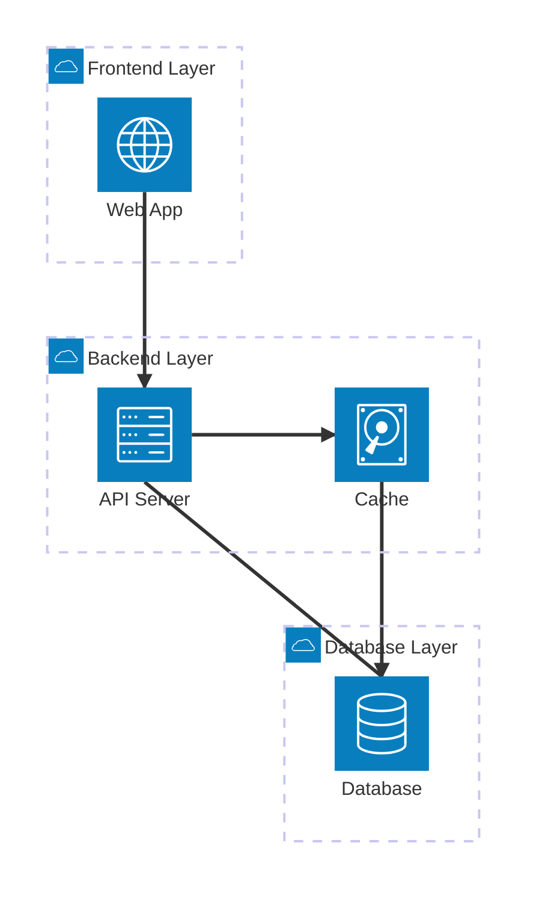
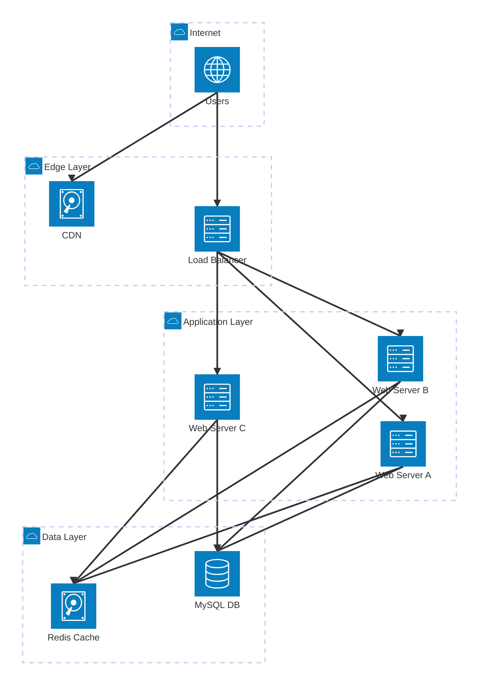
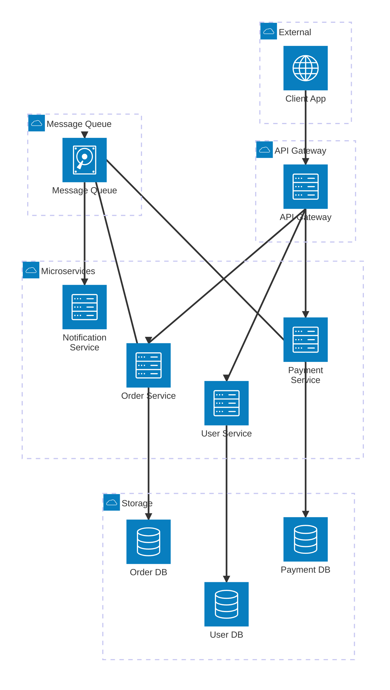
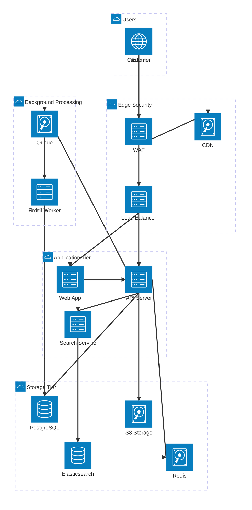
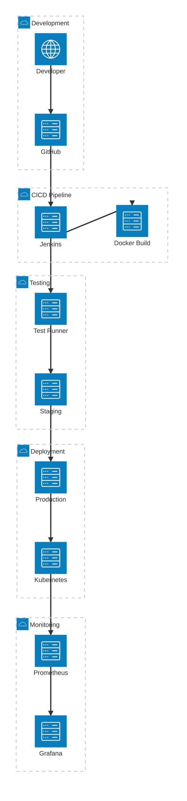
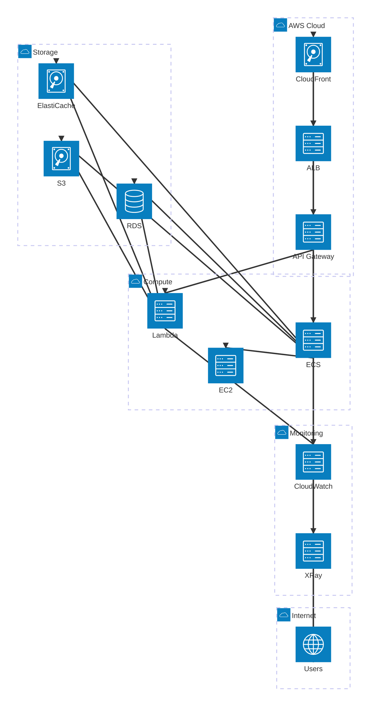
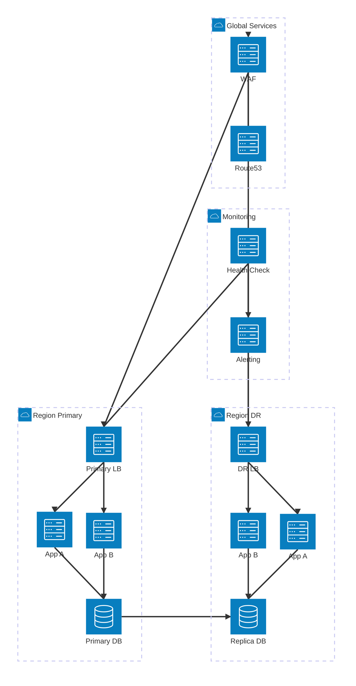
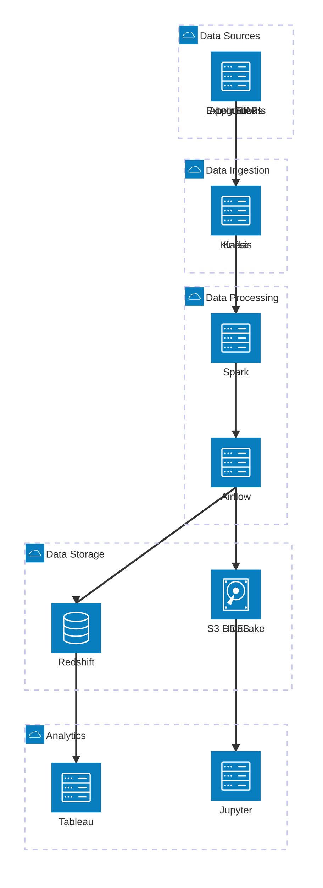

# 🏗️ Infrastructure Components Examples với Mermaid Architecture

> Tài liệu này chứa các ví dụ về infrastructure components sử dụng **Mermaid Architecture Diagrams** để minh họa cho việc học tập **đọc hiểu Infrastructure Design** dành cho Junior Backend Developer.

---

## 📋 Mục lục

1. [Basic Infrastructure Components](#1-basic-infrastructure-components)
2. [Web Application Architecture](#2-web-application-architecture)
3. [Microservices Architecture](#3-microservices-architecture)
4. [E-commerce System Architecture](#4-e-commerce-system-architecture)
5. [CI/CD Pipeline Architecture](#5-cicd-pipeline-architecture)
6. [Cloud-Native Architecture](#6-cloud-native-architecture)
7. [High Availability Architecture](#7-high-availability-architecture)
8. [Data Pipeline Architecture](#8-data-pipeline-architecture)

---

## 1. Basic Infrastructure Components

### 🎯 **Mục tiêu**: Hiểu các component cơ bản nhất



**Giải thích:**
- **Frontend Layer**: Nơi user tương tác
- **Backend Layer**: Xử lý business logic
- **Database Layer**: Lưu trữ dữ liệu
- **Cache**: Tăng tốc truy xuất dữ liệu

---

## 2. Web Application Architecture

### 🎯 **Mục tiêu**: Kiến trúc web app cơ bản với load balancer



**Key Components:**
- **CDN**: Phục vụ static assets
- **Load Balancer**: Phân phối traffic
- **Multiple Web Servers**: Horizontal scaling
- **Redis Cache**: Session và data caching
- **MySQL**: Primary database

---

## 3. Microservices Architecture

### 🎯 **Mục tiêu**: Kiến trúc microservices với API Gateway



**Benefits:**
- **Loose coupling**: Mỗi service độc lập
- **Scalability**: Scale từng service riêng biệt
- **Fault isolation**: Lỗi một service không ảnh hưởng toàn hệ thống
- **Technology diversity**: Mỗi service có thể dùng tech stack khác

---

## 4. E-commerce System Architecture

### 🎯 **Mục tiêu**: Hệ thống e-commerce hoàn chỉnh



**Advanced Features:**
- **WAF**: Web Application Firewall
- **Search Service**: Elasticsearch for product search
- **Background Workers**: Async processing
- **S3 Storage**: File uploads (images, documents)

---

## 5. CI/CD Pipeline Architecture

### 🎯 **Mục tiêu**: DevOps pipeline cho deployment



**Pipeline Stages:**
1. **Code Commit**: Developer push code to GitHub
2. **Build**: Jenkins triggers Docker build
3. **Test**: Automated testing
4. **Deploy**: Deploy to staging, then production
5. **Monitor**: Prometheus + Grafana monitoring

---

## 6. Cloud-Native Architecture

### 🎯 **Mục tiêu**: AWS-based cloud architecture



**AWS Services:**
- **CloudFront**: Global CDN
- **ALB**: Application Load Balancer
- **Lambda**: Serverless functions
- **ECS**: Container orchestration
- **RDS**: Managed database
- **ElastiCache**: Managed Redis/Memcached
- **XRay**: Distributed tracing

---

## 7. High Availability Architecture

### 🎯 **Mục tiêu**: Kiến trúc đảm bảo uptime cao



**HA Features:**
- **Multi-Region**: Primary + Disaster Recovery
- **Database Replication**: Real-time sync
- **Health Monitoring**: Automatic failover
- **DNS Failover**: Route 53 health checks

---

## 8. Data Pipeline Architecture

### 🎯 **Mục tiêu**: Big Data processing pipeline



**Data Flow:**
1. **Ingestion**: Kafka/Kinesis collect data
2. **Processing**: Spark processes data
3. **Orchestration**: Airflow manages workflows
4. **Storage**: HDFS, Redshift, S3 store processed data
5. **Analytics**: Tableau, Jupyter for visualization

---

## 🎯 Tổng kết: Cách sử dụng Mermaid Architecture

### 📝 **Syntax Summary:**

```mermaid
architecture-beta
    group groupName(icon)[Group Label]
    service serviceName(icon)[Service Label] in groupName
    junction junctionName
    
    serviceName:T --> B:anotherService
    serviceName{group}:R --> L:externalService{group}
```

### 🔧 **Key Elements:**

1. **Groups**: `group name(icon)[Label]`
2. **Services**: `service name(icon)[Label] in group`
3. **Junctions**: `junction name`
4. **Connections**: `service1:T --> B:service2`
5. **Directions**: `T` (Top), `B` (Bottom), `L` (Left), `R` (Right)

### 🎨 **Available Icons:**
- `cloud`, `server`, `database`, `disk`, `internet`
- AWS icons: `logos:aws-lambda`, `logos:aws-s3`, `logos:aws-ec2`
- 200,000+ icons from iconify.design

### 💡 **Best Practices:**

1. **Group related services** together
2. **Use descriptive labels** for clarity
3. **Show data flow direction** with arrows
4. **Keep diagrams simple** and readable
5. **Use consistent naming** conventions


