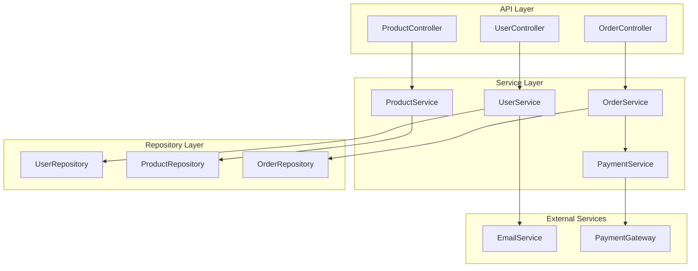
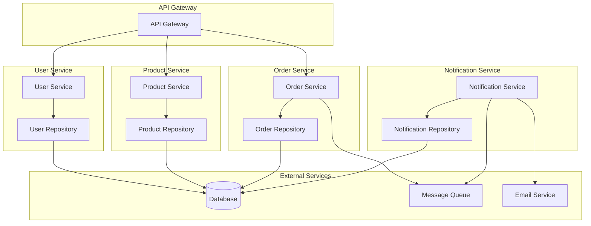
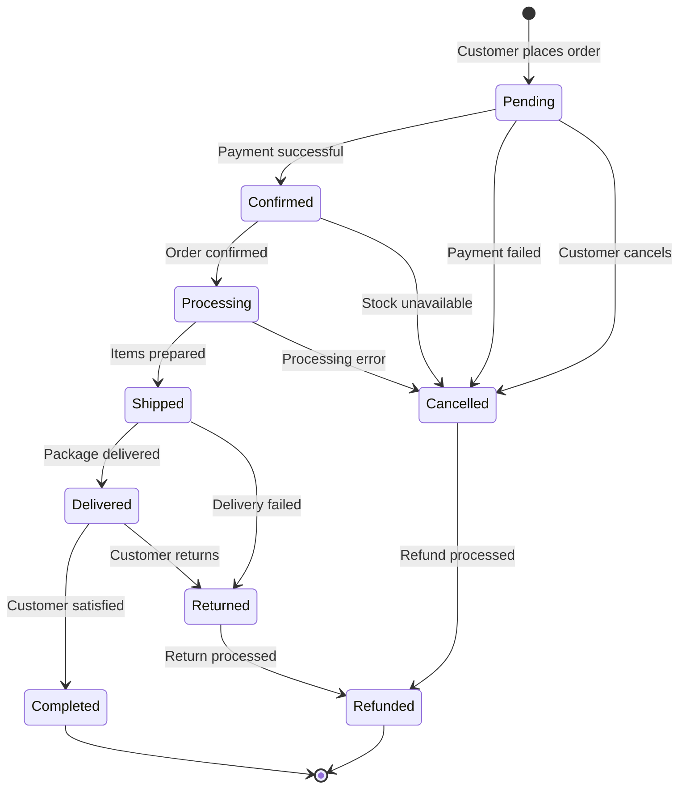
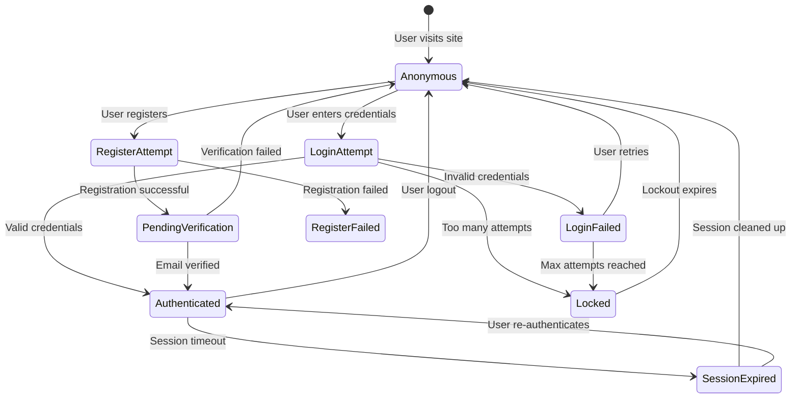
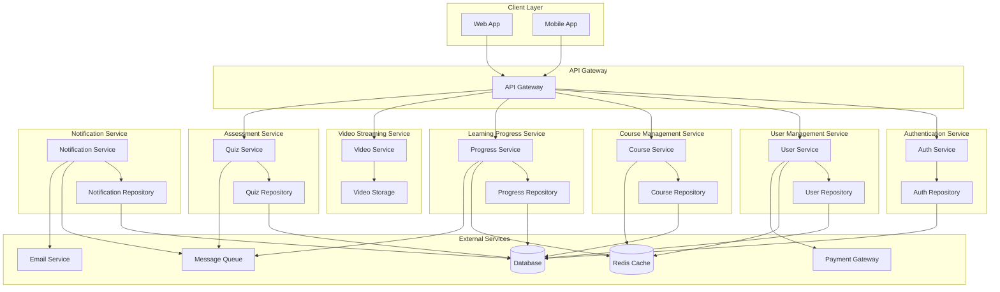
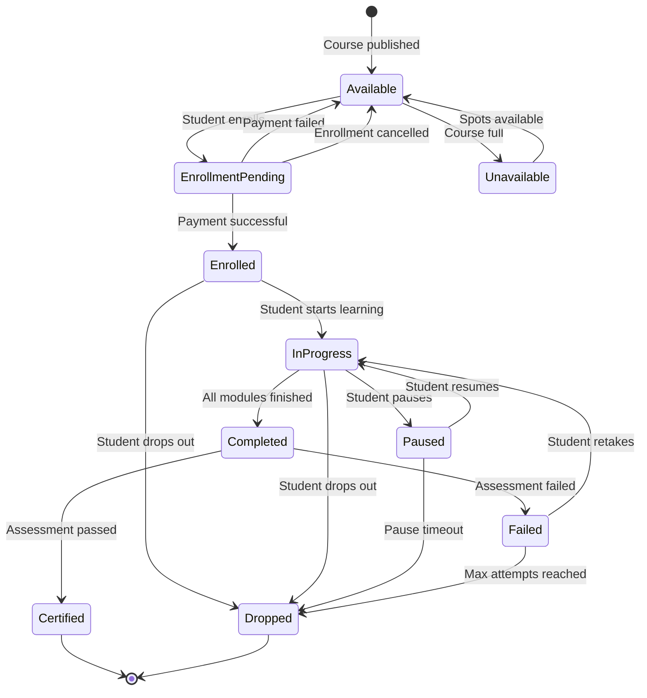

# 📐 **TÀI LIỆU HỌC TẬP UML DIAGRAMS NÂNG CAO**

## 📘 Phần 3.4 – Hướng dẫn sử dụng UML diagram nâng cao cho Server-side

> Tài liệu này dành cho **Junior Developer** học cách sử dụng **Component Diagram** và **State Diagram** trong thiết kế hệ thống server-side. Mỗi phần đều có ví dụ cụ thể và hướng dẫn từng bước.

---

## 🎯 **Mục tiêu học tập**

Sau khi hoàn thành tài liệu này, bạn sẽ:

- ✅ Hiểu **mục đích và cách sử dụng Component Diagram**
- ✅ Biết cách **đọc và vẽ State Diagram**
- ✅ Áp dụng được 2 loại diagram này vào **dự án thực tế**
- ✅ Có thể **giao tiếp hiệu quả với team** thông qua diagrams

---

## 📋 **Mục lục**

1. [Component Diagram](#1-component-diagram)
2. [State Diagram](#2-state-diagram)
3. [Kết hợp trong dự án thực tế](#3-kết-hợp-trong-dự-án-thực-tế)
4. [Tools và Best Practices](#4-tools-và-best-practices)

---

# 1. Component Diagram

## 🤔 **Component Diagram là gì?**

**Component Diagram** là sơ đồ UML mô tả:
- **Các module/component** trong hệ thống
- **Mối quan hệ** giữa các component
- **Interfaces** mà component cung cấp/sử dụng

### 📌 **Khi nào sử dụng Component Diagram?**

1. **Thiết kế kiến trúc** hệ thống mới
2. **Phân tách module** trong dự án lớn
3. **Tài liệu hóa** codebase cho team
4. **Refactoring** code legacy

---

## 🧩 **Các thành phần cơ bản**

### 1️⃣ **Component (Thành phần)**
```
┌─────────────────┐
│   <<component>> │
│  UserService    │
└─────────────────┘
```

### 2️⃣ **Interface (Giao diện)**
```
○ IUserRepository    (Provided Interface - component cung cấp)
◐ IEmailService     (Required Interface - component cần)
```

### 3️⃣ **Dependency (Phụ thuộc)**
```
ComponentA ──────> ComponentB
          (depends on)
```

---

## 💡 **Ví dụ 1: E-commerce API Server**

### 📋 **Bài toán**: Thiết kế component cho hệ thống e-commerce



### 🔍 **Giải thích chi tiết**:

**API Layer (Tầng điều khiển)**:
- `UserController`: Xử lý HTTP requests về user
- `ProductController`: Quản lý products
- `OrderController`: Xử lý orders

**Service Layer (Tầng business logic)**:
- `UserService`: Business logic cho user
- `ProductService`: Xử lý logic products
- `OrderService`: Quản lý quy trình đặt hàng
- `PaymentService`: Xử lý thanh toán

**Repository Layer (Tầng dữ liệu)**:
- `UserRepository`: Truy xuất dữ liệu user
- `ProductRepository`: Truy xuất dữ liệu product
- `OrderRepository`: Truy xuất dữ liệu order

---

## 💻 **Code Implementation Example**

### 📝 **UserService Component**

```typescript
// Interface mà UserService cung cấp
interface IUserService {
    createUser(userData: UserDto): Promise<User>;
    getUserById(id: string): Promise<User>;
    updateUser(id: string, userData: UserDto): Promise<User>;
    deleteUser(id: string): Promise<void>;
}

// Interface mà UserService cần
interface IUserRepository {
    save(user: User): Promise<User>;
    findById(id: string): Promise<User>;
    update(id: string, user: User): Promise<User>;
    delete(id: string): Promise<void>;
}

interface IEmailService {
    sendWelcomeEmail(email: string): Promise<void>;
}

// Implementation
class UserService implements IUserService {
    constructor(
        private userRepository: IUserRepository,  // Required interface
        private emailService: IEmailService      // Required interface
    ) {}

    async createUser(userData: UserDto): Promise<User> {
        // Business logic
        const user = new User(userData);
        await this.userRepository.save(user);
        await this.emailService.sendWelcomeEmail(user.email);
        return user;
    }

    // ... other methods
}
```

---

## 🏗️ **Ví dụ 2: Microservices Architecture**

### 📋 **Bài toán**: Thiết kế component cho hệ thống microservices



### 🔍 **Giải thích Microservices Components**:

**API Gateway**:
- Điểm vào duy nhất cho tất cả requests
- Routing, authentication, rate limiting

**User Service**:
- Quản lý thông tin user
- Independent deployment
- Own database

**Product Service**:
- Quản lý catalog sản phẩm
- Product search, filtering
- Inventory management

**Order Service**:
- Xử lý đặt hàng
- Tích hợp với payment
- Order tracking

**Notification Service**:
- Gửi thông báo
- Email, SMS, push notifications
- Event-driven architecture

---

## 🎯 **Lợi ích của Component Diagram**

### ✅ **Cho Developer**:
- **Hiểu rõ structure** của hệ thống
- **Xác định dependencies** giữa các module
- **Dễ dàng testing** với mock interfaces
- **Refactoring** an toàn hơn

### ✅ **Cho Team**:
- **Giao tiếp hiệu quả** về kiến trúc
- **Phân chia công việc** rõ ràng
- **Code review** tốt hơn
- **Onboarding** junior dễ dàng

---

# 2. State Diagram

## 🤔 **State Diagram là gì?**

**State Diagram** là sơ đồ UML mô tả:
- **Các trạng thái** (states) của một đối tượng
- **Sự kiện** (events) làm thay đổi trạng thái
- **Điều kiện** (conditions) để chuyển đổi trạng thái

### 📌 **Khi nào sử dụng State Diagram?**

1. **Workflow management** (order processing, user registration)
2. **Business process modeling** (approval workflow)
3. **State machines** (game states, connection states)
4. **API behavior** (authentication states)

---

## 🧩 **Các thành phần cơ bản**

### 1️⃣ **State (Trạng thái)**
```
┌─────────────┐
│   Pending   │
└─────────────┘
```

### 2️⃣ **Initial State (Trạng thái ban đầu)**
```
● ───────> [First State]
```

### 3️⃣ **Final State (Trạng thái kết thúc)**
```
[Last State] ───────> ◉
```

### 4️⃣ **Transition (Chuyển đổi)**
```
[State A] ──event/action──> [State B]
```

---

## 💡 **Ví dụ 1: Order Processing System**

### 📋 **Bài toán**: Mô tả trạng thái của đơn hàng



### 🔍 **Giải thích chi tiết các trạng thái**:

**Pending (Chờ xử lý)**:
- Đơn hàng vừa được tạo
- Chờ thanh toán hoặc xác nhận

**Confirmed (Đã xác nhận)**:
- Thanh toán thành công
- Sẵn sàng cho processing

**Processing (Đang xử lý)**:
- Đang chuẩn bị hàng
- Đóng gói và giao cho shipper

**Shipped (Đã giao)**:
- Đang vận chuyển
- Có tracking number

**Delivered (Đã giao)**:
- Khách hàng đã nhận hàng
- Chờ feedback

**Completed (Hoàn tất)**:
- Giao dịch thành công
- Không có khiếu nại

**Cancelled (Đã hủy)**:
- Đơn hàng bị hủy
- Các lý do khác nhau

**Returned (Đã trả)**:
- Khách hàng trả hàng
- Chờ xử lý hoàn tiền

**Refunded (Đã hoàn tiền)**:
- Hoàn tiền thành công
- Giao dịch kết thúc

---

## 💻 **Code Implementation Example**

### 📝 **Order State Machine**

```typescript
// Enum cho các trạng thái
enum OrderState {
    PENDING = 'pending',
    CONFIRMED = 'confirmed',
    PROCESSING = 'processing',
    SHIPPED = 'shipped',
    DELIVERED = 'delivered',
    COMPLETED = 'completed',
    CANCELLED = 'cancelled',
    RETURNED = 'returned',
    REFUNDED = 'refunded'
}

// Enum cho các sự kiện
enum OrderEvent {
    PAYMENT_SUCCESS = 'payment_success',
    PAYMENT_FAILED = 'payment_failed',
    CUSTOMER_CANCEL = 'customer_cancel',
    CONFIRM_ORDER = 'confirm_order',
    STOCK_UNAVAILABLE = 'stock_unavailable',
    START_PROCESSING = 'start_processing',
    PROCESSING_ERROR = 'processing_error',
    SHIP_ORDER = 'ship_order',
    DELIVER_ORDER = 'deliver_order',
    DELIVERY_FAILED = 'delivery_failed',
    CUSTOMER_SATISFIED = 'customer_satisfied',
    CUSTOMER_RETURN = 'customer_return',
    PROCESS_RETURN = 'process_return',
    PROCESS_REFUND = 'process_refund'
}

// State machine definition
const ORDER_STATE_MACHINE = {
    [OrderState.PENDING]: {
        [OrderEvent.PAYMENT_SUCCESS]: OrderState.CONFIRMED,
        [OrderEvent.PAYMENT_FAILED]: OrderState.CANCELLED,
        [OrderEvent.CUSTOMER_CANCEL]: OrderState.CANCELLED
    },
    [OrderState.CONFIRMED]: {
        [OrderEvent.CONFIRM_ORDER]: OrderState.PROCESSING,
        [OrderEvent.STOCK_UNAVAILABLE]: OrderState.CANCELLED
    },
    [OrderState.PROCESSING]: {
        [OrderEvent.SHIP_ORDER]: OrderState.SHIPPED,
        [OrderEvent.PROCESSING_ERROR]: OrderState.CANCELLED
    },
    [OrderState.SHIPPED]: {
        [OrderEvent.DELIVER_ORDER]: OrderState.DELIVERED,
        [OrderEvent.DELIVERY_FAILED]: OrderState.RETURNED
    },
    [OrderState.DELIVERED]: {
        [OrderEvent.CUSTOMER_SATISFIED]: OrderState.COMPLETED,
        [OrderEvent.CUSTOMER_RETURN]: OrderState.RETURNED
    },
    [OrderState.RETURNED]: {
        [OrderEvent.PROCESS_RETURN]: OrderState.REFUNDED
    },
    [OrderState.CANCELLED]: {
        [OrderEvent.PROCESS_REFUND]: OrderState.REFUNDED
    }
};

// Order class với state machine
class Order {
    private state: OrderState;
    private id: string;
    private customerId: string;
    private items: OrderItem[];
    private totalAmount: number;

    constructor(customerId: string, items: OrderItem[]) {
        this.id = generateId();
        this.customerId = customerId;
        this.items = items;
        this.totalAmount = this.calculateTotal();
        this.state = OrderState.PENDING;
    }

    // Phương thức chuyển đổi trạng thái
    transition(event: OrderEvent): boolean {
        const transitions = ORDER_STATE_MACHINE[this.state];
        
        if (!transitions || !transitions[event]) {
            console.error(`Invalid transition: ${this.state} -> ${event}`);
            return false;
        }

        const previousState = this.state;
        this.state = transitions[event];
        
        console.log(`Order ${this.id}: ${previousState} -> ${this.state}`);
        
        // Thực hiện side effects
        this.performSideEffects(event);
        
        return true;
    }

    // Xử lý side effects khi chuyển đổi trạng thái
    private performSideEffects(event: OrderEvent): void {
        switch (event) {
            case OrderEvent.PAYMENT_SUCCESS:
                this.sendConfirmationEmail();
                break;
            case OrderEvent.SHIP_ORDER:
                this.generateTrackingNumber();
                break;
            case OrderEvent.DELIVER_ORDER:
                this.notifyCustomer();
                break;
            // ... other side effects
        }
    }

    // Kiểm tra trạng thái hiện tại
    getCurrentState(): OrderState {
        return this.state;
    }

    // Kiểm tra xem có thể thực hiện event không
    canTransition(event: OrderEvent): boolean {
        const transitions = ORDER_STATE_MACHINE[this.state];
        return transitions && transitions[event] !== undefined;
    }

    // Lấy danh sách events có thể thực hiện
    getAvailableEvents(): OrderEvent[] {
        const transitions = ORDER_STATE_MACHINE[this.state];
        return transitions ? Object.keys(transitions) as OrderEvent[] : [];
    }

    private sendConfirmationEmail(): void {
        // Logic gửi email xác nhận
    }

    private generateTrackingNumber(): void {
        // Logic tạo tracking number
    }

    private notifyCustomer(): void {
        // Logic thông báo customer
    }

    private calculateTotal(): number {
        return this.items.reduce((total, item) => total + item.price * item.quantity, 0);
    }
}
```

### 🎯 **Sử dụng Order State Machine**:

```typescript
// Tạo đơn hàng mới
const order = new Order('customer123', [
    { productId: 'prod1', quantity: 2, price: 50 },
    { productId: 'prod2', quantity: 1, price: 30 }
]);

console.log(order.getCurrentState()); // 'pending'

// Xử lý thanh toán thành công
order.transition(OrderEvent.PAYMENT_SUCCESS);
console.log(order.getCurrentState()); // 'confirmed'

// Xác nhận đơn hàng
order.transition(OrderEvent.CONFIRM_ORDER);
console.log(order.getCurrentState()); // 'processing'

// Giao hàng
order.transition(OrderEvent.SHIP_ORDER);
console.log(order.getCurrentState()); // 'shipped'

// Giao thành công
order.transition(OrderEvent.DELIVER_ORDER);
console.log(order.getCurrentState()); // 'delivered'

// Khách hàng hài lòng
order.transition(OrderEvent.CUSTOMER_SATISFIED);
console.log(order.getCurrentState()); // 'completed'

// Kiểm tra events có thể thực hiện
console.log(order.getAvailableEvents()); // []
```

---

## 💡 **Ví dụ 2: User Authentication System**

### 📋 **Bài toán**: Mô tả trạng thái của user authentication



### 💻 **Code Implementation**:

```typescript
enum AuthState {
    ANONYMOUS = 'anonymous',
    LOGIN_ATTEMPT = 'login_attempt',
    REGISTER_ATTEMPT = 'register_attempt',
    LOGIN_FAILED = 'login_failed',
    LOCKED = 'locked',
    PENDING_VERIFICATION = 'pending_verification',
    AUTHENTICATED = 'authenticated',
    SESSION_EXPIRED = 'session_expired',
    REGISTER_FAILED = 'register_failed'
}

enum AuthEvent {
    LOGIN = 'login',
    REGISTER = 'register',
    VALID_CREDENTIALS = 'valid_credentials',
    INVALID_CREDENTIALS = 'invalid_credentials',
    TOO_MANY_ATTEMPTS = 'too_many_attempts',
    REGISTRATION_SUCCESS = 'registration_success',
    REGISTRATION_FAILED = 'registration_failed',
    RETRY = 'retry',
    LOCKOUT_EXPIRES = 'lockout_expires',
    EMAIL_VERIFIED = 'email_verified',
    VERIFICATION_FAILED = 'verification_failed',
    SESSION_TIMEOUT = 'session_timeout',
    LOGOUT = 'logout',
    SESSION_CLEANUP = 'session_cleanup',
    RE_AUTHENTICATE = 're_authenticate'
}

class UserAuthentication {
    private state: AuthState;
    private userId: string;
    private loginAttempts: number;
    private lockoutExpiry: Date | null;

    constructor(userId: string) {
        this.userId = userId;
        this.state = AuthState.ANONYMOUS;
        this.loginAttempts = 0;
        this.lockoutExpiry = null;
    }

    transition(event: AuthEvent): boolean {
        const previousState = this.state;
        
        switch (this.state) {
            case AuthState.ANONYMOUS:
                if (event === AuthEvent.LOGIN) {
                    this.state = AuthState.LOGIN_ATTEMPT;
                } else if (event === AuthEvent.REGISTER) {
                    this.state = AuthState.REGISTER_ATTEMPT;
                }
                break;
                
            case AuthState.LOGIN_ATTEMPT:
                if (event === AuthEvent.VALID_CREDENTIALS) {
                    this.state = AuthState.AUTHENTICATED;
                    this.resetLoginAttempts();
                } else if (event === AuthEvent.INVALID_CREDENTIALS) {
                    this.loginAttempts++;
                    if (this.loginAttempts >= 3) {
                        this.state = AuthState.LOCKED;
                        this.setLockoutExpiry();
                    } else {
                        this.state = AuthState.LOGIN_FAILED;
                    }
                }
                break;
                
            case AuthState.REGISTER_ATTEMPT:
                if (event === AuthEvent.REGISTRATION_SUCCESS) {
                    this.state = AuthState.PENDING_VERIFICATION;
                } else if (event === AuthEvent.REGISTRATION_FAILED) {
                    this.state = AuthState.REGISTER_FAILED;
                }
                break;
                
            case AuthState.LOGIN_FAILED:
                if (event === AuthEvent.RETRY) {
                    this.state = AuthState.ANONYMOUS;
                }
                break;
                
            case AuthState.LOCKED:
                if (event === AuthEvent.LOCKOUT_EXPIRES && this.isLockoutExpired()) {
                    this.state = AuthState.ANONYMOUS;
                    this.resetLoginAttempts();
                }
                break;
                
            case AuthState.PENDING_VERIFICATION:
                if (event === AuthEvent.EMAIL_VERIFIED) {
                    this.state = AuthState.AUTHENTICATED;
                } else if (event === AuthEvent.VERIFICATION_FAILED) {
                    this.state = AuthState.ANONYMOUS;
                }
                break;
                
            case AuthState.AUTHENTICATED:
                if (event === AuthEvent.SESSION_TIMEOUT) {
                    this.state = AuthState.SESSION_EXPIRED;
                } else if (event === AuthEvent.LOGOUT) {
                    this.state = AuthState.ANONYMOUS;
                }
                break;
                
            case AuthState.SESSION_EXPIRED:
                if (event === AuthEvent.SESSION_CLEANUP) {
                    this.state = AuthState.ANONYMOUS;
                } else if (event === AuthEvent.RE_AUTHENTICATE) {
                    this.state = AuthState.AUTHENTICATED;
                }
                break;
        }

        if (previousState !== this.state) {
            console.log(`Auth ${this.userId}: ${previousState} -> ${this.state}`);
            return true;
        }
        
        return false;
    }

    private resetLoginAttempts(): void {
        this.loginAttempts = 0;
    }

    private setLockoutExpiry(): void {
        this.lockoutExpiry = new Date(Date.now() + 15 * 60 * 1000); // 15 minutes
    }

    private isLockoutExpired(): boolean {
        return this.lockoutExpiry && new Date() > this.lockoutExpiry;
    }

    getCurrentState(): AuthState {
        return this.state;
    }

    getLoginAttempts(): number {
        return this.loginAttempts;
    }

    isAuthenticated(): boolean {
        return this.state === AuthState.AUTHENTICATED;
    }
}
```

---

## 🎯 **Lợi ích của State Diagram**

### ✅ **Cho Developer**:
- **Hiểu rõ business logic** phức tạp
- **Tránh bugs** liên quan đến state inconsistency
- **Dễ testing** với state transitions
- **Maintainable code** với clear state management

### ✅ **Cho Business**:
- **Visualize workflow** rõ ràng
- **Identify edge cases** và exception handling
- **Communicate requirements** hiệu quả
- **Process optimization** opportunities

---

# 3. Kết hợp trong dự án thực tế

## 🏗️ **Case Study: E-learning Platform**

### 📋 **Bài toán**: Thiết kế hệ thống e-learning với cả Component và State diagrams

---

## 🧩 **Component Diagram cho E-learning Platform**



---

## 🔄 **State Diagram cho Course Enrollment**



---

## 💻 **Implementation Example**

### 📝 **Course Enrollment Service**

```typescript
// Course Service Component
interface ICourseService {
    enrollStudent(courseId: string, studentId: string): Promise<Enrollment>;
    startLearning(enrollmentId: string): Promise<void>;
    pauseLearning(enrollmentId: string): Promise<void>;
    resumeLearning(enrollmentId: string): Promise<void>;
    completeModule(enrollmentId: string, moduleId: string): Promise<void>;
    submitAssessment(enrollmentId: string, answers: Answer[]): Promise<AssessmentResult>;
}

// Enrollment State Machine
enum EnrollmentState {
    AVAILABLE = 'available',
    ENROLLMENT_PENDING = 'enrollment_pending',
    ENROLLED = 'enrolled',
    IN_PROGRESS = 'in_progress',
    PAUSED = 'paused',
    COMPLETED = 'completed',
    CERTIFIED = 'certified',
    FAILED = 'failed',
    DROPPED = 'dropped',
    UNAVAILABLE = 'unavailable'
}

enum EnrollmentEvent {
    PUBLISH_COURSE = 'publish_course',
    STUDENT_ENROLL = 'student_enroll',
    COURSE_FULL = 'course_full',
    PAYMENT_SUCCESS = 'payment_success',
    PAYMENT_FAILED = 'payment_failed',
    CANCEL_ENROLLMENT = 'cancel_enrollment',
    START_LEARNING = 'start_learning',
    DROP_OUT = 'drop_out',
    PAUSE_LEARNING = 'pause_learning',
    RESUME_LEARNING = 'resume_learning',
    COMPLETE_COURSE = 'complete_course',
    PASS_ASSESSMENT = 'pass_assessment',
    FAIL_ASSESSMENT = 'fail_assessment',
    RETAKE_COURSE = 'retake_course',
    MAX_ATTEMPTS_REACHED = 'max_attempts_reached',
    SPOTS_AVAILABLE = 'spots_available',
    PAUSE_TIMEOUT = 'pause_timeout'
}

class CourseEnrollment {
    private state: EnrollmentState;
    private courseId: string;
    private studentId: string;
    private enrollmentDate: Date;
    private completionPercentage: number;
    private assessmentAttempts: number;
    private pauseDate: Date | null;

    constructor(courseId: string, studentId: string) {
        this.courseId = courseId;
        this.studentId = studentId;
        this.state = EnrollmentState.AVAILABLE;
        this.enrollmentDate = new Date();
        this.completionPercentage = 0;
        this.assessmentAttempts = 0;
        this.pauseDate = null;
    }

    transition(event: EnrollmentEvent): boolean {
        const previousState = this.state;
        
        switch (this.state) {
            case EnrollmentState.AVAILABLE:
                if (event === EnrollmentEvent.STUDENT_ENROLL) {
                    this.state = EnrollmentState.ENROLLMENT_PENDING;
                } else if (event === EnrollmentEvent.COURSE_FULL) {
                    this.state = EnrollmentState.UNAVAILABLE;
                }
                break;
                
            case EnrollmentState.ENROLLMENT_PENDING:
                if (event === EnrollmentEvent.PAYMENT_SUCCESS) {
                    this.state = EnrollmentState.ENROLLED;
                } else if (event === EnrollmentEvent.PAYMENT_FAILED || 
                          event === EnrollmentEvent.CANCEL_ENROLLMENT) {
                    this.state = EnrollmentState.AVAILABLE;
                }
                break;
                
            case EnrollmentState.ENROLLED:
                if (event === EnrollmentEvent.START_LEARNING) {
                    this.state = EnrollmentState.IN_PROGRESS;
                } else if (event === EnrollmentEvent.DROP_OUT) {
                    this.state = EnrollmentState.DROPPED;
                }
                break;
                
            case EnrollmentState.IN_PROGRESS:
                if (event === EnrollmentEvent.COMPLETE_COURSE) {
                    this.state = EnrollmentState.COMPLETED;
                } else if (event === EnrollmentEvent.PAUSE_LEARNING) {
                    this.state = EnrollmentState.PAUSED;
                    this.pauseDate = new Date();
                } else if (event === EnrollmentEvent.DROP_OUT) {
                    this.state = EnrollmentState.DROPPED;
                }
                break;
                
            case EnrollmentState.PAUSED:
                if (event === EnrollmentEvent.RESUME_LEARNING) {
                    this.state = EnrollmentState.IN_PROGRESS;
                    this.pauseDate = null;
                } else if (event === EnrollmentEvent.PAUSE_TIMEOUT || 
                          event === EnrollmentEvent.DROP_OUT) {
                    this.state = EnrollmentState.DROPPED;
                }
                break;
                
            case EnrollmentState.COMPLETED:
                if (event === EnrollmentEvent.PASS_ASSESSMENT) {
                    this.state = EnrollmentState.CERTIFIED;
                } else if (event === EnrollmentEvent.FAIL_ASSESSMENT) {
                    this.state = EnrollmentState.FAILED;
                }
                break;
                
            case EnrollmentState.FAILED:
                if (event === EnrollmentEvent.RETAKE_COURSE) {
                    this.state = EnrollmentState.IN_PROGRESS;
                    this.assessmentAttempts++;
                } else if (event === EnrollmentEvent.MAX_ATTEMPTS_REACHED) {
                    this.state = EnrollmentState.DROPPED;
                }
                break;
                
            case EnrollmentState.UNAVAILABLE:
                if (event === EnrollmentEvent.SPOTS_AVAILABLE) {
                    this.state = EnrollmentState.AVAILABLE;
                }
                break;
        }

        if (previousState !== this.state) {
            console.log(`Enrollment ${this.courseId}-${this.studentId}: ${previousState} -> ${this.state}`);
            this.performSideEffects(event);
            return true;
        }
        
        return false;
    }

    private performSideEffects(event: EnrollmentEvent): void {
        switch (event) {
            case EnrollmentEvent.PAYMENT_SUCCESS:
                this.sendEnrollmentConfirmation();
                break;
            case EnrollmentEvent.START_LEARNING:
                this.trackLearningStart();
                break;
            case EnrollmentEvent.PASS_ASSESSMENT:
                this.generateCertificate();
                break;
            case EnrollmentEvent.PAUSE_LEARNING:
                this.scheduleResumeReminder();
                break;
            // ... other side effects
        }
    }

    private sendEnrollmentConfirmation(): void {
        // Logic gửi email xác nhận đăng ký
    }

    private trackLearningStart(): void {
        // Logic tracking bắt đầu học
    }

    private generateCertificate(): void {
        // Logic tạo certificate
    }

    private scheduleResumeReminder(): void {
        // Logic schedule reminder để resume
    }

    // Getters
    getCurrentState(): EnrollmentState {
        return this.state;
    }

    getCompletionPercentage(): number {
        return this.completionPercentage;
    }

    updateProgress(percentage: number): void {
        this.completionPercentage = percentage;
        if (percentage >= 100) {
            this.transition(EnrollmentEvent.COMPLETE_COURSE);
        }
    }
}
```

### 🎯 **Course Service Implementation**:

```typescript
class CourseService implements ICourseService {
    constructor(
        private courseRepository: ICourseRepository,
        private enrollmentRepository: IEnrollmentRepository,
        private paymentService: IPaymentService,
        private notificationService: INotificationService
    ) {}

    async enrollStudent(courseId: string, studentId: string): Promise<Enrollment> {
        // Tạo enrollment mới
        const enrollment = new CourseEnrollment(courseId, studentId);
        
        // Trigger enrollment process
        enrollment.transition(EnrollmentEvent.STUDENT_ENROLL);
        
        // Lưu vào database
        await this.enrollmentRepository.save(enrollment);
        
        // Xử lý payment
        const paymentResult = await this.paymentService.processPayment(
            studentId, 
            courseId
        );
        
        if (paymentResult.success) {
            enrollment.transition(EnrollmentEvent.PAYMENT_SUCCESS);
        } else {
            enrollment.transition(EnrollmentEvent.PAYMENT_FAILED);
        }
        
        await this.enrollmentRepository.update(enrollment);
        
        return enrollment;
    }

    async startLearning(enrollmentId: string): Promise<void> {
        const enrollment = await this.enrollmentRepository.findById(enrollmentId);
        
        if (enrollment.transition(EnrollmentEvent.START_LEARNING)) {
            await this.enrollmentRepository.update(enrollment);
        }
    }

    async pauseLearning(enrollmentId: string): Promise<void> {
        const enrollment = await this.enrollmentRepository.findById(enrollmentId);
        
        if (enrollment.transition(EnrollmentEvent.PAUSE_LEARNING)) {
            await this.enrollmentRepository.update(enrollment);
        }
    }

    async resumeLearning(enrollmentId: string): Promise<void> {
        const enrollment = await this.enrollmentRepository.findById(enrollmentId);
        
        if (enrollment.transition(EnrollmentEvent.RESUME_LEARNING)) {
            await this.enrollmentRepository.update(enrollment);
        }
    }

    async completeModule(enrollmentId: string, moduleId: string): Promise<void> {
        const enrollment = await this.enrollmentRepository.findById(enrollmentId);
        
        // Cập nhật progress
        const progress = await this.calculateProgress(enrollmentId, moduleId);
        enrollment.updateProgress(progress);
        
        await this.enrollmentRepository.update(enrollment);
    }

    async submitAssessment(enrollmentId: string, answers: Answer[]): Promise<AssessmentResult> {
        const enrollment = await this.enrollmentRepository.findById(enrollmentId);
        
        // Chấm điểm
        const score = await this.gradeAssessment(answers);
        const passed = score >= 80; // 80% to pass
        
        if (passed) {
            enrollment.transition(EnrollmentEvent.PASS_ASSESSMENT);
        } else {
            enrollment.transition(EnrollmentEvent.FAIL_ASSESSMENT);
        }
        
        await this.enrollmentRepository.update(enrollment);
        
        return {
            score,
            passed,
            enrollmentState: enrollment.getCurrentState()
        };
    }

    private async calculateProgress(enrollmentId: string, moduleId: string): Promise<number> {
        // Logic tính progress
        return 0;
    }

    private async gradeAssessment(answers: Answer[]): Promise<number> {
        // Logic chấm điểm
        return 0;
    }
}
```

---

# 4. Tools và Best Practices

## 🛠️ **Tools for Creating UML Diagrams**

### 1️⃣ **Online Tools**:
- **PlantUML**: Text-based UML diagrams
- **Lucidchart**: Professional diagramming
- **Draw.io**: Free online diagramming
- **Mermaid**: Markdown-based diagrams

### 2️⃣ **Desktop Tools**:
- **Visual Paradigm**: Professional UML tool
- **Enterprise Architect**: Enterprise-grade modeling
- **Visio**: Microsoft diagramming tool
- **OmniGraffle**: Mac-specific diagramming

### 3️⃣ **IDE Plugins**:
- **PlantUML Plugin**: For VS Code, IntelliJ
- **Mermaid Preview**: For VS Code
- **UML Class Diagrams**: For various IDEs

---

## 📚 **Best Practices**

### ✅ **Component Diagram Best Practices**:

1. **Keep it Simple**:
   - Không quá chi tiết
   - Focus vào high-level components
   - Avoid implementation details

2. **Clear Naming**:
   - Sử dụng business terms
   - Consistent naming convention
   - Avoid technical jargon

3. **Logical Grouping**:
   - Group related components
   - Separate concerns clearly
   - Show dependencies explicitly

4. **Documentation**:
   - Include component descriptions
   - Document interfaces
   - Explain design decisions

### ✅ **State Diagram Best Practices**:

1. **Complete State Coverage**:
   - Cover all possible states
   - Include error states
   - Handle edge cases

2. **Clear Transitions**:
   - Label all transitions
   - Specify conditions
   - Include actions/side effects

3. **Avoid State Explosion**:
   - Use composite states
   - Abstract common patterns
   - Keep diagrams readable

4. **Validation**:
   - Test state transitions
   - Validate business rules
   - Review with stakeholders

---

## 🎯 **Khi nào sử dụng từng loại diagram**

### 📊 **Component Diagram**:
- ✅ **Thiết kế kiến trúc** hệ thống mới
- ✅ **Refactoring** legacy code
- ✅ **Team communication** về structure
- ✅ **Dependency management**

### 📊 **State Diagram**:
- ✅ **Complex business workflows**
- ✅ **Entity lifecycle management**
- ✅ **State machine implementation**
- ✅ **Process documentation**

---

## 🏆 **Kết luận**

### 🎯 **Takeaways cho Junior Developer**:

1. **Component Diagram** giúp bạn:
   - Hiểu rõ kiến trúc hệ thống
   - Thiết kế code modular
   - Giao tiếp hiệu quả với team

2. **State Diagram** giúp bạn:
   - Xử lý business logic phức tạp
   - Tránh bugs về state inconsistency
   - Implement reliable workflows

3. **Kết hợp cả hai**:
   - Tạo ra design documents hoàn chỉnh
   - Improve code quality
   - Better project maintenance

### 🚀 **Next Steps**:

1. **Practice**: Tạo diagrams cho dự án hiện tại
2. **Review**: Analyze existing codebases với diagrams
3. **Collaborate**: Sử dụng diagrams trong team discussions
4. **Iterate**: Improve diagrams based on feedback

---

## 📖 **Tài liệu tham khảo**

- [UML 2.5 Specification](https://www.omg.org/spec/UML/)
- [PlantUML Documentation](https://plantuml.com/)
- [Mermaid Documentation](https://mermaid-js.github.io/mermaid/)
- [Clean Architecture by Robert Martin](https://blog.cleancoder.com/uncle-bob/2012/08/13/the-clean-architecture.html)

---

**🎉 Chúc bạn học tập hiệu quả và áp dụng thành công UML Diagrams trong dự án thực tế!**
